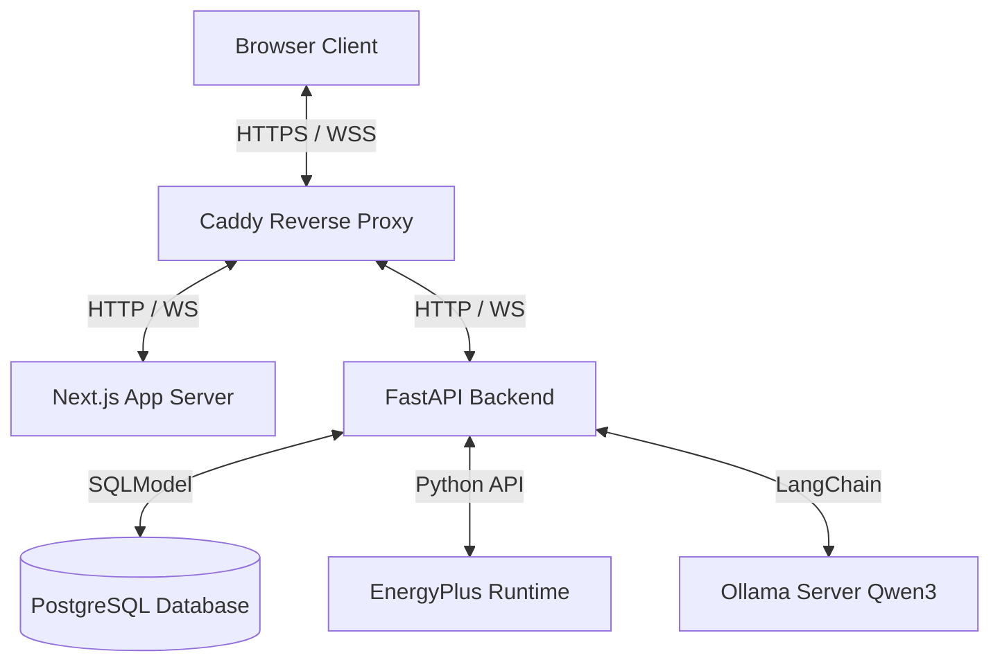
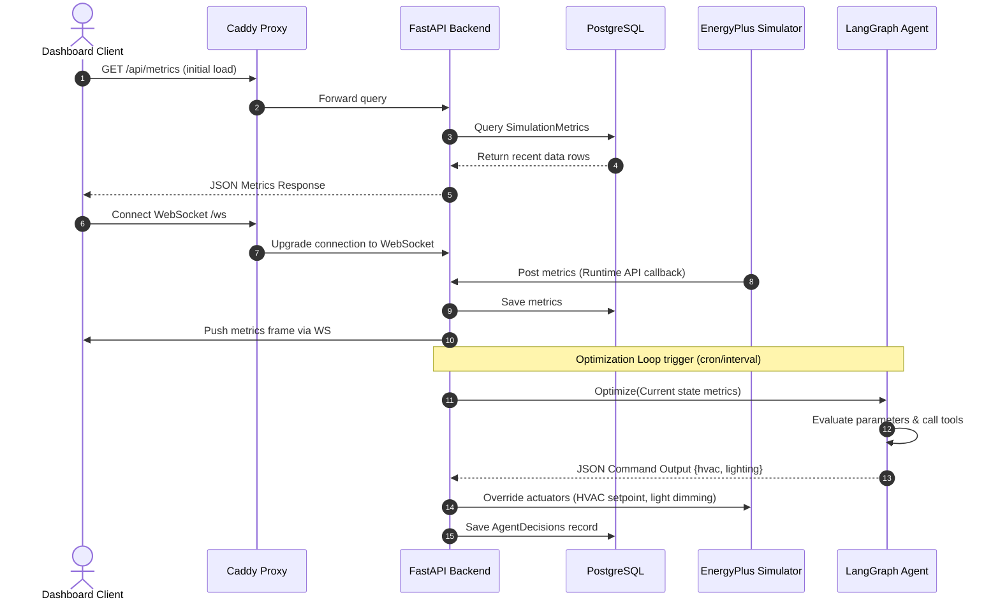
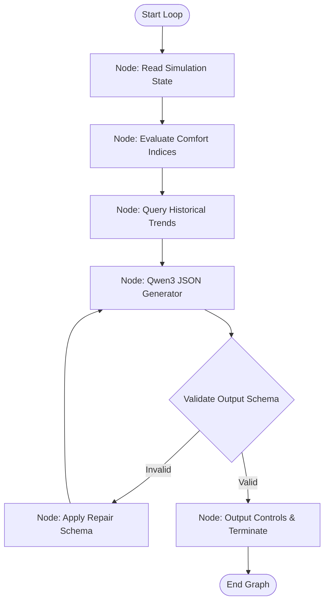
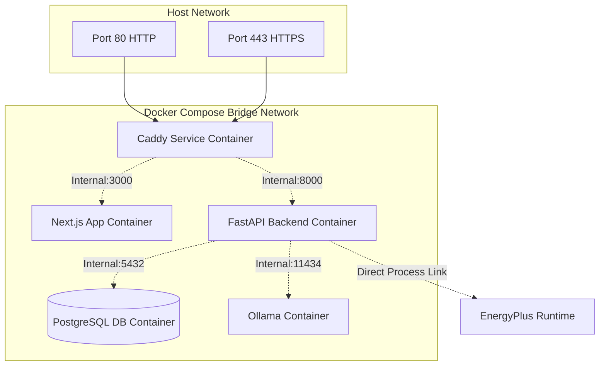

# System Architecture

## High-Level Architecture

```text
                    Internet
                        │
                     Caddy
                        │
        ┌───────────────┴───────────────┐
        │                               │
        ▼                               ▼
 Next.js Dashboard                FastAPI Backend
                                          │
                                          ▼
                                 LangGraph AI Agent
                                          │
                                          ▼
                                    Ollama (Qwen3)
                                          │
                                          ▼
                                 EnergyPlus Runtime
                                          │
                                          ▼
                                 Building Simulation
```

Below is the corresponding component diagram illustrating communication protocols:



---

## Component Responsibilities

### 1. Caddy Reverse Proxy
- **Traffic Routing**: Acts as the single ingress point, routing traffic to the Next.js Frontend or the FastAPI Backend based on matching URL routes (`/` vs `/api/*`).
- **SSL Termination**: Automatically handles TLS certificate generation and renewal.

### 2. Next.js Dashboard
- **Live Monitoring UI**: Renders charts, KPIs, logs, and timelines in real-time.
- **State Management**: Uses Zustand to maintain dashboard layout preferences and local states.
- **Server Actions & API Consumption**: Fetches initial states via SSR and hydrates live metrics using WebSocket subscriptions.

### 3. FastAPI Backend
- **Data Ingestion**: Exposes REST and WebSocket endpoints for dashboard queries, simulation control, and system health checks.
- **Simulation Management**: Orchestrates the launch, pause, step, and stop controls of the EnergyPlus runtime.
- **AI Agent Host**: Exposes the trigger interface for the LangGraph Optimization Agent.
- **Database Handler**: Handles writing simulation metrics, agent decisions, and audit trails to the PostgreSQL database.

### 4. LangGraph AI Agent
- **State Machine Routing**: Manages the multi-step optimization workflow (evaluating metrics, validating options, deciding control variables, formatting output).
- **Tool Execution**: Enables the agent to query historical ranges or consult simulation metadata.
- **Self-Correction Loop**: Validates LLM output formatting and retries code extraction if parsing errors occur.

### 5. Ollama (Qwen3)
- **Local Model Execution**: Runs the Qwen3 7B Instruct model locally on an execution container.
- **Inference Server**: Exposes standard OpenAI-compatible API endpoints for LangChain to execute prompt templates.

### 6. EnergyPlus Runtime
- **Physical Building Simulator**: Processes building models (IDF files) and weather datasets (EPW files).
- **Python API Integration**: Executes inline Python callbacks within the EnergyPlus execution loop, enabling real-time variable inspection and actuator overriding.

### 7. PostgreSQL Database
- **Persistent Data Store**: Houses long-term metrics, agent optimization choices, error logs, and credential schemas.

---

## Request Flow



---

## AI Workflow (LangGraph)

The Optimization Agent executes as a stateful graph where each node represents a specific reasoning phase:



---

## Deployment & Docker Network Topology

The system is deployed using Docker Compose on an AWS EC2 instance. All backend services reside on a private internal virtual bridge network, while only Caddy is exposed to the host's public ports.


