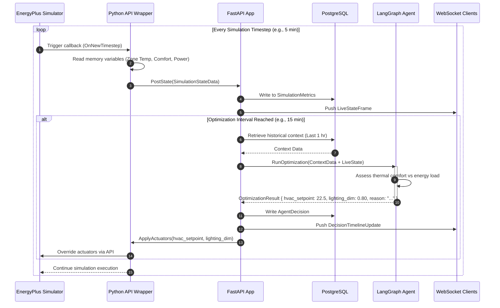

# System Design

This document details the data structures, internal service definitions, and communication flows that enable real-time building control optimization.

---

## Data Flow Diagram

The optimization loop runs as a closed feedback loop:

```text
       ┌────────────────────────────────────────────────────────┐
       │                                                        │
       ▼                                                        │
┌──────────────┐      ┌────────────────────┐      ┌─────────────┴──────┐
│  EnergyPlus  ├─────►│ Simulation Metrics ├─────►│   FastAPI Backend  │
│  Simulation  │      │   (Raw Outputs)    │      │    (Ingestion)     │
└──────▲───────┘      └────────────────────┘      └─────────────┬──────┘
       │                                                        │
       │                                                        ▼
┌──────┴───────┐      ┌────────────────────┐      ┌────────────────────┐
│   Actuator   │◄─────┤  Updated Controls  │◄─────┤   LangGraph Agent  │
│  Overrides   │      │    (JSON Set)      │      │ (Decision Engine)  │
└──────────────┘      └────────────────────┘      └────────────────────┘
```

Detailed loop stages:
1. **Simulation Step**: EnergyPlus processes the model building thermal dynamics for a given timestep.
2. **Metrics Collection**: The Python Runtime API reads zone temperature, outdoor humidity, occupancy counts, and utility meters.
3. **Ingestion**: The backend consumes these variables, performs sanity checks, writes to the Database, and transmits the state to the Client via WebSockets.
4. **Trigger Condition**: Every optimization interval (e.g., simulated 15 minutes), the backend packages current and recent historical state metrics.
5. **Reasoning Phase**: The LangGraph agent reads metrics and prompt guidance to generate recommended HVAC and lighting adjustments.
6. **Actuation override**: The backend overrides the corresponding EnergyPlus actuators through the Python runtime API bindings.
7. **Simulation execution**: EnergyPlus runs the next step using the new setpoints.

---

## Detailed Sequence Diagram



---

## Component Communication Specs

### 1. External Client to Backend
* **Protocols**: HTTP/S (REST) for configuration operations, and WebSockets (WS/S) for continuous data updates.
* **Payloads**: JSON format.
* **Websocket URI**: `/api/v1/simulation/ws`. Messages pushed to the client follow a standard structure:
  ```json
  {
    "type": "METRIC_UPDATE" | "DECISION_LOG" | "STATUS_CHANGE",
    "timestamp": "2026-07-25T17:58:00Z",
    "data": {}
  }
  ```

### 2. Backend to Database
* **ORM Library**: `SQLModel` wrapping `SQLAlchemy` async sessions.
* **Pool Configuration**: Max pool size of 20 connections, with automatic connection recycle timer (1800s) to prevent timeouts.

### 3. Backend to Ollama
* **Protocol**: HTTP/S POST to `http://ollama:11434/api/chat`.
* **Timeout**: 60 seconds (generous for complex agent reasoning cycles).

### 4. Backend to EnergyPlus
* **Integration**: Python C-types bindings. Actuator coordinates are accessed via string indices mapped during the simulation initialization step.

---

## Internal Service Definitions

### `SimulationManagerService`
* **File Path Reference**: `backend/services/simulation.py`
* **Responsibilities**:
  - Validates input IDF and weather EPW files.
  - Spawns the EnergyPlus execution loop thread.
  - Exposes process status indicators (`NOT_STARTED`, `RUNNING`, `PAUSED`, `COMPLETED`, `ERROR`).
  - Manages stepping/pausing through standard synchronization primitives (Event/Condition locks).

### `DataIngestionService`
* **File Path Reference**: `backend/services/ingestion.py`
* **Responsibilities**:
  - Normalizes raw outputs from EnergyPlus (e.g. converting temperatures from Kelvin to Celsius if necessary).
  - Calculates secondary indices, such as PMV (Predicted Mean Vote) and PPD (Predicted Percentage of Dissatisfied) comfort metrics.
  - Batches insert statements into the database.

### `AgentRunnerService`
* **File Path Reference**: `backend/agent/runner.py`
* **Responsibilities**:
  - Compiles the LangGraph flow state.
  - Assembles the prompt context (combining current weather, comfort parameters, and historical usage).
  - Handles parsing failures by invoking a structured-JSON retry parser loop.
  - Emits telemetry logs containing token consumption profiles.

### `ActuationControlService`
* **File Path Reference**: `backend/services/actuation.py`
* **Responsibilities**:
  - Translates agent output recommendations into actual EnergyPlus API Actuator command overrides.
  - Enforces safety limits (e.g. preventing HVAC setpoint overrides below 18°C or above 28°C).
