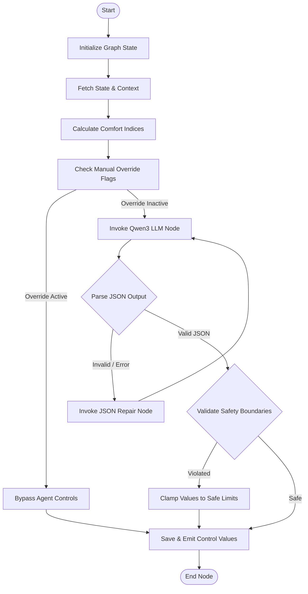

# AI Agent Design

The EcoLoop AI Agent uses LangGraph to coordinate multi-step reasoning cycles. By hosting an open-source Qwen3 7B Instruct model locally on Ollama, it evaluates building states and generates optimal control schedules.

---

## Agent Responsibilities

1. **Energy Minimization**: Continually looks for opportunities to reduce HVAC loads, disable lighting in unoccupied areas, and optimize cooling setpoints.
2. **Occupant Comfort Guardrails**: Maintains thermal comfort index thresholds (e.g., Predicted Mean Vote PMV target between `-0.5` and `+0.5`).
3. **Structured Outputs**: Formats decisions into parseable JSON payloads, avoiding verbose chat content that could cause system errors.
4. **Explainable AI**: Logs clear, actionable reasoning paragraphs for every control adjustment.

---

## Decision Pipeline (LangGraph Graph)

The decision cycle is structured as a stateful, cyclic workflow:



### Graph State Structure
The graph stores execution variables in a typed dictionary:
```python
class AgentState(TypedDict):
    timestamp: str
    current_metrics: dict
    historical_context: list[dict]
    system_rules: dict
    raw_llm_output: str
    parsed_controls: dict
    validation_errors: list[str]
    execution_attempts: int
```

---

## Prompt Engineering

### System Prompt Template
```text
You are an expert HVAC and building energy management agent named EcoLoop. 
Your objective is to optimize the indoor climate controls of a commercial building.
You will receive the current state metrics, weather profiles, occupancy schedules, and historical performance context.

Core constraints:
1. Always maintain a Predicted Mean Vote (PMV) thermal comfort value between -0.7 and +0.7.
2. Reduce energy consumption by adjusting heating/cooling setpoints and dimming lights when zones are unoccupied.
3. Outputs MUST strictly follow the provided JSON schema. Do not add conversational text.

Current Safety Parameters:
- Cooling Setpoint Limits: {min_cooling_setpoint}°C to {max_cooling_setpoint}°C
- Heating Setpoint Limits: {min_heating_setpoint}°C to {max_heating_setpoint}°C
- Lighting Dimming Limits: {min_light_dim}% to {max_light_dim}%
```

### User Context Template
```json
{
  "timestamp": "2026-07-25T17:58:00Z",
  "building_state": {
    "indoor_temp": 24.1,
    "outdoor_temp": 32.5,
    "relative_humidity": 55.2,
    "occupancy_count": 12,
    "pmv": 0.45
  },
  "utility_rate_period": "PEAK",
  "historical_hvac_power_kw": [45.2, 44.8, 45.1]
}
```

---

## Tool Calling Configuration

To make informed adjustments, the agent is equipped with native tools:

| Tool Name | Parameters | Purpose | Return Value |
| :--- | :--- | :--- | :--- |
| `get_historical_weather` | `hours: int` | Fetches weather forecasts for upcoming cycles. | Array of forecasted values |
| `get_comfort_rules` | None | Retrieves current comfort setpoint boundaries. | JSON rule config |
| `query_energy_tariffs` | `time: str` | Checks current utility peak pricing structures. | Rate class (`PEAK`, `OFF-PEAK`) |

---

## Memory Architecture

The agent combines two types of memory models:
1. **Short-Term Context (Episodic)**: Appends the recent 6 timesteps (30 minutes of simulation state) directly inside the LLM prompt context window.
2. **Long-Term Memory (Semantic)**: Writes all final decisions, reasoning logs, and user feedback evaluations to the database. During low-efficiency execution states, the system queries this database using vector search to retrieve similar states and learn from past successes.

---

## Output Schema Example

The LLM is structured to respond using a single JSON object.

### JSON Output Model
```json
{
  "hvac": 22.0,
  "lighting": 75,
  "reason": "Occupancy is below threshold. Adjusted cooling setpoint to 22C and dimmed lights to 75% to save energy while maintaining a comfort PMV within acceptable limits."
}
```

### Validator & Repair Loop
If Qwen3 outputs invalid JSON strings or missing keys, the parser catches the error:
1. Increments `execution_attempts` state.
2. Appends the exact stack trace message to the prompt.
3. Re-runs the LLM node with a system instruction to fix formatting errors.
4. If it fails 3 times, a default fallback baseline configuration is loaded.
