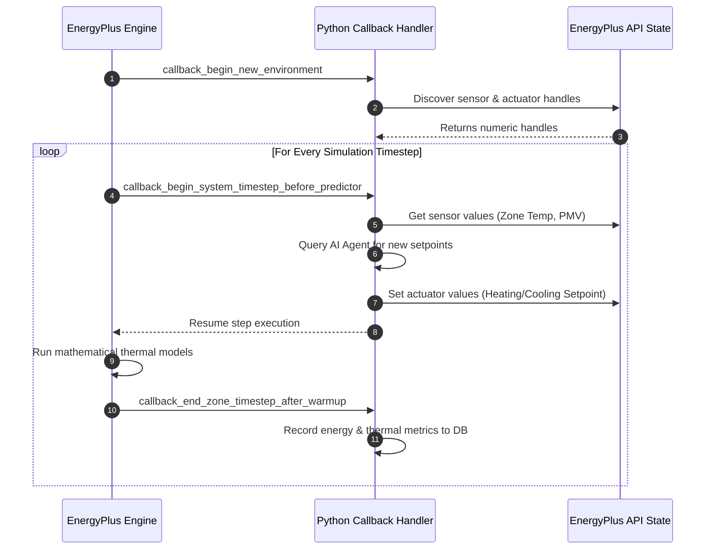

# EnergyPlus Integration Specification

This document details the interface between the FastAPI backend and the EnergyPlus simulation engine using the EnergyPlus Python Runtime API.

---

## Data Integration Flow

The communication flow between components uses direct memory pointers exposed by the shared object wrapper bindings:

```text
┌────────────────┐      ┌────────────────┐      ┌─────────────────┐
│   EnergyPlus   │      │ Python Runtime │      │ FastAPI Backend │
│   Simulation   ├─────►│  API Wrapper   ├─────►│  (Event Loop)   │
│ (Native C/C++) │      │   (C-Types)    │      │                 │
└──────▲─────────┘      └────────┬───────┘      └────────┬────────┘
       │                         │                       │
       │                         ▼                       ▼
       │                ┌────────────────┐      ┌─────────────────┐
       │                │ Actuator State │      │    LangGraph    │
       └────────────────┤    Override    │◄─────┤    AI Agent     │
                        └────────────────┘      └─────────────────┘
```

Detailed stages:
1. **EnergyPlus Native Execution**: EnergyPlus runs the thermal mathematical model.
2. **Python Callback**: At each simulated timestep, EnergyPlus invokes a registered Python callback handler.
3. **Data Harvesting**: The Python callback reads simulation sensors directly from memory pointers.
4. **State Transmission**: Data is emitted to the FastAPI backend.
5. **AI Reasoning**: The AI Agent evaluates parameters and produces control outputs.
6. **Actuator Override**: The FastAPI backend sets variables in EnergyPlus using direct Actuator references.
7. **Resume**: EnergyPlus processes the next timestep with updated actuate properties.

---

## Model Components

### 1. IDF (Input Data File) Models
The building design is described in an Input Data File (`.idf`), which defines:
- **Geometry**: Zone dimensions, window configurations, wall layers, and orientation.
- **Schedules**: Normal occupancy, lighting, equipment use, and thermostat baselines.
- **HVAC Systems**: Air loops, plant loops, fans, boilers, chillers, and thermostat control components.
- **Sensors and Actuators**: Elements exposing internal state variables (like zone air temperature) and accepting controller overrides (like thermostat temperature setpoints).

### 2. EPW (EnergyPlus Weather) Files
Weather inputs are provided by a location-specific EnergyPlus Weather (`.epw`) file:
- Exposes outdoor dry-bulb temperature, relative humidity, wind speed, and solar radiation metrics.
- Processes weather steps synchronously, step-by-step alongside the IDF timestep sequence.

---

## Python Runtime API Integration

EnergyPlus (version 9.6+) compiles a native library (`libenergyplusapi.so` on Linux) that can be imported directly into Python.

```python
# Conceptual Python API Initialization
from pyenergyplus.api import EnergyPlusAPI

api = EnergyPlusAPI()
state = api.state_manager.new_state()
```

### The Simulation Loop & Callback Mechanism
We hook into the simulation execution by registering callbacks on specific API run events. The primary events utilized are:
1. **`callback_begin_system_timestep_before_predictor`**: Triggered before HVAC controls decide temperature offsets. This is the optimal window to inject actuator overrides.
2. **`callback_end_zone_timestep_after_warmup`**: Triggered when zone temperatures stabilize, providing clean metrics.



---

## Implementation Code Blueprint

Below is the conceptual architecture of the `backend/energyplus/runtime.py` runner service:

```python
import sys
import threading
from pyenergyplus.api import EnergyPlusAPI

class EnergyPlusRunner:
    def __init__(self, idf_path: str, epw_path: str, output_dir: str):
        self.api = EnergyPlusAPI()
        self.state = self.api.state_manager.new_state()
        self.idf_path = idf_path
        self.epw_path = epw_path
        self.output_dir = output_dir
        
        # Sensor & Actuator handles placeholder
        self.handles = {}
        self.latest_metrics = {}
        self.setpoint_override = None

    def register_callbacks(self):
        # Register handlers to capture variables and inject overrides
        self.api.runtime.callback_begin_system_timestep_before_predictor(
            self.state, self._before_predictor_callback
        )
        self.api.runtime.callback_end_zone_timestep_after_warmup(
            self.state, self._after_warmup_callback
        )

    def _before_predictor_callback(self, state_pointer):
        # 1. Resolve handles if not already cached
        if not self.handles:
            self.handles['zone_temp'] = self.api.exchange.get_variable_handle(
                state_pointer, "Zone Air Temperature", "ZONE_ONE"
            )
            self.handles['hvac_actuator'] = self.api.exchange.get_actuator_handle(
                state_pointer, "Schedule:Constant", "Schedule Value", "Cooling_Setpoint_Sched"
            )

        # 2. Inject override value if provided by the AI Agent
        if self.setpoint_override is not None:
            self.api.exchange.set_actuator_value(
                state_pointer, 
                self.handles['hvac_actuator'], 
                self.setpoint_override
            )

    def _after_warmup_callback(self, state_pointer):
        # Read final sensor states
        temp = self.api.exchange.get_variable_value(
            state_pointer, self.handles['zone_temp']
        )
        self.latest_metrics['zone_temp'] = temp

    def run(self):
        self.register_callbacks()
        # Spawn execution in a secondary thread so FastAPI event loop remains unblocked
        args = [
            "-d", self.output_dir,
            "-w", self.epw_path,
            self.idf_path
        ]
        
        def run_thread():
            self.api.runtime.run_energyplus(self.state, args)
            
        thread = threading.Thread(target=run_thread)
        thread.start()
        return thread
```
