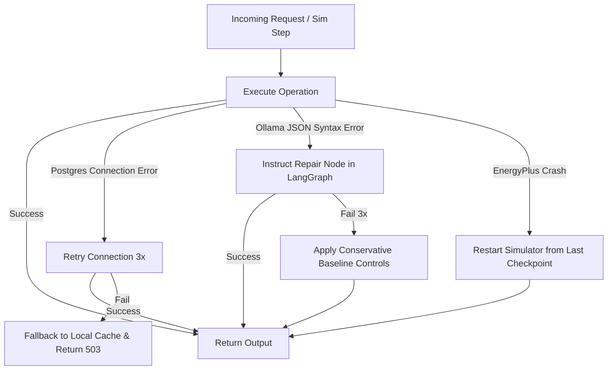

# Backend Architecture

The backend application is developed using Python 3.12 and FastAPI. It serves as the primary coordination layer, linking the EnergyPlus simulator, Ollama local inference engine, PostgreSQL DB, and the web clients.

---

## Architectural Flow

The diagram below details how data flows vertically through the backend modules:

```text
    API (FastAPI Routers) ◄──────────────► WebSocket / Connection Manager
             │                                         ▲
             ▼                                         │
  Services (Business Logic) ───────────────────────────┼
             │                                         │
             ├─────────────────┐                       │
             ▼                 ▼                       │
    EnergyPlus Wrapper    LangGraph Agent ─────────────┘
      (Python API)        (Decision Node)
             │                 │
             ▼                 ▼
             └────────┬────────┘
                      ▼
            Database (SQLModel ORM)
                      │
                      ▼
                 PostgreSQL
```

---

## Directory Structure

The backend application layout is structured modularly:

```text
backend/
├── app/
│   ├── main.py              # Application entrypoint (FastAPI startup / middleware)
│   ├── config.py            # Pydantic Settings configuration loader
│   ├── api/                 # API Routing Layer
│   │   ├── deps.py          # FastAPI dependencies (database sessions, auth)
│   │   ├── endpoints/
│   │   │   ├── simulation.py # Simulation control, status and ws connections
│   │   │   ├── metrics.py    # Historical metrics retrieval endpoints
│   │   │   └── decisions.py  # Agent reasoning logs and override controls
│   │   └── router.py        # Combines sub-routers into single app router
│   ├── services/            # Business Logic Layer
│   │   ├── simulation.py    # Spawns, runs, steps and manages simulator process
│   │   ├── actuation.py     # Sets actuator variables on active simulation thread
│   │   └── analytics.py     # Aggregates raw historical logs for charts
│   ├── agent/               # LangGraph AI Agent Module
│   │   ├── graph.py         # LangGraph workflow compilation
│   │   ├── state.py         # State schemas definition
│   │   ├── prompts.py       # Base prompt templates for Qwen3
│   │   └── tools.py         # Custom agent tools (e.g. database querying)
│   ├── energyplus/          # EnergyPlus Runtime bindings
│   │   ├── runtime.py       # Wrapper wrapping C API callback functions
│   │   ├── idf_parser.py    # Utility to read/inspect IDF files
│   │   └── variables.py     # Config mapping EnergyPlus indexes to system keys
│   ├── database/            # Database Session & Schema Layer
│   │   ├── session.py       # PostgreSQL SQLAlchemy async engine & session maker
│   │   └── models.py        # SQLModel schema classes (Tables)
│   └── utils/               # Helper utilities
│       ├── logger.py        # Loguru configuration setup
│       └── health.py        # Custom dependency health checks (DB, Ollama)
├── requirements.txt
├── Dockerfile
└── README.md
```

---

## Architectural Layer Responsibilities

### 1. API Routing Layer (`app/api/`)
- **FastAPI Endpoints**: Uses resource-based routers (`/api/v1/simulation`, `/api/v1/metrics`, `/api/v1/decisions`).
- **Connection Manager**: Holds active client WebSocket objects, routing broadcasts (`METRIC_UPDATE`) in a non-blocking asynchronous task list.
- **Dependency Injection**: Resolves DB session lifespans per HTTP request.

### 2. Services Layer (`app/services/`)
- **Simulation Coordinator**: Launches the EnergyPlus execution loop on a separate OS thread or daemon process, using thread-safe synchronization locks (like `threading.Event`) to coordinate steps.
- **Setpoints Actuator**: Validates that agent decisions stay inside physical building boundaries before changing control variables.

### 3. AI Agent Layer (`app/agent/`)
- **LangGraph Workflow**: Compiles nodes representing task steps (State Reader -> Comfort Evaluator -> Decision Generation -> JSON Schema Verification).
- **Execution Manager**: Calls Ollama using asynchronous client interfaces, preserving token performance data.

### 4. EnergyPlus Layer (`app/energyplus/`)
- **C API Bindings**: Loads the native shared library file (`.so`/`.dll`) using python API frameworks, providing callback hooks on simulated timesteps.
- **Variable Mappings**: Dynamically discovers actuators in the parsed IDF template.

### 5. Database Layer (`app/database/`)
- **SQLModel Config**: Defines python class schemas representing DB tables and maps Pydantic variables to SQL columns.
- **Async Execution**: Employs async PostgreSQL drivers (`asyncpg`) to prevent long SQL operations from blocking the single-threaded Python event loop.

### 6. Utilities Layer (`app/utils/`)
- **Loguru integration**: Routes standard library warnings and errors into customized stdout formatting, outputting JSON files for backend production container logs.
- **Health Indicators**: System components monitor connection metrics, reporting downstream services health statuses to `/api/health`.

---

## Error Handling & Resiliency Flow


