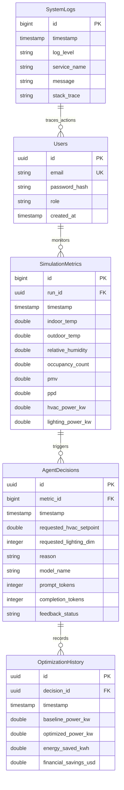

# Database Schema Specification

This document details the database schema configuration for the PostgreSQL instance. It lists tables, columns, indexes, and relations used in the EcoLoop Building Agents application.

---

## Entity Relationship (ER) Diagram



---

## Table Specifications

### 1. `Users` Table
* **Purpose**: Stores authorized user accounts accessing the admin overrides and optimization dashboards.
* **Columns**:
  - `id`: `UUID` (Primary Key, Default: `gen_random_uuid()`)
  - `email`: `VARCHAR(255)` (Unique, Indexed, Not Null)
  - `password_hash`: `VARCHAR(255)` (Not Null)
  - `role`: `VARCHAR(50)` (Not Null, default: `'operator'`, values: `'admin'`, `'operator'`, `'viewer'`)
  - `created_at`: `TIMESTAMP WITH TIME ZONE` (Default: `CURRENT_TIMESTAMP`)

### 2. `SimulationMetrics` Table
* **Purpose**: Records time-series sensor outputs generated by the EnergyPlus simulation loop.
* **Columns**:
  - `id`: `BIGINT` (Primary Key, Auto-incrementing / Serial)
  - `run_id`: `UUID` (Indexed, Grouping key for simulation runs, Not Null)
  - `timestamp`: `TIMESTAMP WITH TIME ZONE` (Indexed, Not Null)
  - `indoor_temp`: `DOUBLE PRECISION` (Not Null, Celsius)
  - `outdoor_temp`: `DOUBLE PRECISION` (Not Null, Celsius)
  - `relative_humidity`: `DOUBLE PRECISION` (Not Null, Percent)
  - `occupancy_count`: `DOUBLE PRECISION` (Not Null)
  - `pmv`: `DOUBLE PRECISION` (Predicted Mean Vote comfort index)
  - `ppd`: `DOUBLE PRECISION` (Predicted Percentage Dissatisfied index)
  - `hvac_power_kw`: `DOUBLE PRECISION` (Power consumed by heating/cooling coils & fans)
  - `lighting_power_kw`: `DOUBLE PRECISION` (Power consumed by lighting zones)

### 3. `AgentDecisions` Table
* **Purpose**: Logs decision outputs and model tokens metrics from the LangGraph agent execution.
* **Columns**:
  - `id`: `UUID` (Primary Key, Default: `gen_random_uuid()`)
  - `metric_id`: `BIGINT` (Foreign Key referencing `SimulationMetrics.id`, Cascade Delete)
  - `timestamp`: `TIMESTAMP WITH TIME ZONE` (Indexed, Default: `CURRENT_TIMESTAMP`)
  - `requested_hvac_setpoint`: `DOUBLE PRECISION` (Target HVAC thermostat temperature value)
  - `requested_lighting_dim`: `INTEGER` (Dimming target value, range 0-100)
  - `reason`: `TEXT` (Explainable text generated by Qwen3 model)
  - `model_name`: `VARCHAR(100)` (Model signature tag, e.g., `'qwen3-7b-instruct'`)
  - `prompt_tokens`: `INTEGER` (Number of tokens passed inside context prompt)
  - `completion_tokens`: `INTEGER` (Number of tokens generated inside model response)
  - `feedback_status`: `VARCHAR(50)` (Operator evaluation feedback tag, default: `'unrated'`, values: `'unrated'`, `'correct'`, `'incorrect'`)

### 4. `OptimizationHistory` Table
* **Purpose**: Details realized conservation metrics comparing optimized results to IDF baselines.
* **Columns**:
  - `id`: `UUID` (Primary Key, Default: `gen_random_uuid()`)
  - `decision_id`: `UUID` (Foreign Key referencing `AgentDecisions.id`, Cascade Delete)
  - `timestamp`: `TIMESTAMP WITH TIME ZONE` (Indexed, Not Null)
  - `baseline_power_kw`: `DOUBLE PRECISION` (Hypothetical power without agent action, from IDF schedules)
  - `optimized_power_kw`: `DOUBLE PRECISION` (Observed physical power under agent overrides)
  - `energy_saved_kwh`: `DOUBLE PRECISION` (Calculated savings: `(baseline_power - optimized_power) * step_hour`)
  - `financial_savings_usd`: `DOUBLE PRECISION` (Energy savings multiplied by current tariff rate)

### 5. `SystemLogs` Table
* **Purpose**: Diagnostics log repository tracking application and simulator failures.
* **Columns**:
  - `id`: `BIGINT` (Primary Key, Auto-incrementing / Serial)
  - `timestamp`: `TIMESTAMP WITH TIME ZONE` (Indexed, Default: `CURRENT_TIMESTAMP`)
  - `log_level`: `VARCHAR(50)` (Severity levels: `'DEBUG'`, `'INFO'`, `'WARNING'`, `'ERROR'`, `'CRITICAL'`)
  - `service_name`: `VARCHAR(100)` (Originating service container tag, e.g., `'agent'`, `'simulator'`)
  - `message`: `TEXT` (Descriptive error summary)
  - `stack_trace`: `TEXT` (Python traceback dump if exceptions occur, Nullable)

---

## SQLModel Python Declarations

Below is the implementation blueprint for the Python database configuration:

```python
from datetime import datetime
from typing import Optional
from uuid import UUID, uuid4
from sqlmodel import SQLModel, Field, Relationship

class User(SQLModel, table=True):
    __tablename__: str = "users"
    id: UUID = Field(default_factory=uuid4, primary_key=True)
    email: str = Field(unique=True, index=True)
    password_hash: str
    role: str = Field(default="operator")
    created_at: datetime = Field(default_factory=datetime.utcnow)

class SimulationMetric(SQLModel, table=True):
    __tablename__: str = "simulation_metrics"
    id: Optional[int] = Field(default=None, primary_key=True)
    run_id: UUID = Field(index=True)
    timestamp: datetime = Field(index=True)
    indoor_temp: float
    outdoor_temp: float
    relative_humidity: float
    occupancy_count: float
    pmv: Optional[float] = None
    ppd: Optional[float] = None
    hvac_power_kw: float
    lighting_power_kw: float
    
    decisions: list["AgentDecision"] = Relationship(back_populates="metric")

class AgentDecision(SQLModel, table=True):
    __tablename__: str = "agent_decisions"
    id: UUID = Field(default_factory=uuid4, primary_key=True)
    metric_id: int = Field(foreign_key="simulation_metrics.id")
    timestamp: datetime = Field(default_factory=datetime.utcnow, index=True)
    requested_hvac_setpoint: float
    requested_lighting_dim: int
    reason: str
    model_name: str
    prompt_tokens: int
    completion_tokens: int
    feedback_status: str = Field(default="unrated")
    
    metric: SimulationMetric = Relationship(back_populates="decisions")
    history: Optional["OptimizationHistory"] = Relationship(back_populates="decision")

class OptimizationHistory(SQLModel, table=True):
    __tablename__: str = "optimization_history"
    id: UUID = Field(default_factory=uuid4, primary_key=True)
    decision_id: UUID = Field(foreign_key="agent_decisions.id")
    timestamp: datetime = Field(index=True)
    baseline_power_kw: float
    optimized_power_kw: float
    energy_saved_kwh: float
    financial_savings_usd: float
    
    decision: AgentDecision = Relationship(back_populates="history")

class SystemLog(SQLModel, table=True):
    __tablename__: str = "system_logs"
    id: Optional[int] = Field(default=None, primary_key=True)
    timestamp: datetime = Field(default_factory=datetime.utcnow, index=True)
    log_level: str
    service_name: str
    message: str
    stack_trace: Optional[str] = None
```
