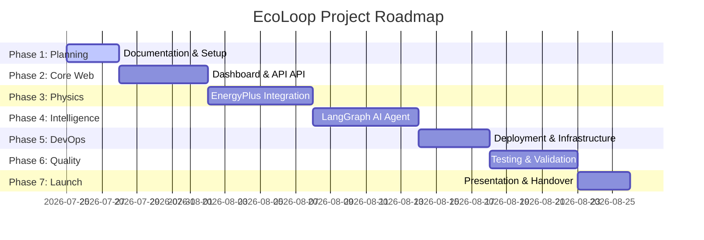

# Project Roadmap

This document outlines the execution phases, key deliverables, and target timelines for the development and release of the EcoLoop platform.

---

## Phase Overview

---

## Phase Details

### Phase 1: Planning, Setup & Base Docs
* **Objectives**: Define architecture blueprints, set up empty repository boilerplate directories, configure basic docker file hooks.
* **Deliverables**:
  - [x] Complete Markdown specifications under `docs/`.
  - [ ] GitHub Repository initialization with branch protection rules.
  - [ ] Base Dockerfiles for FastAPI and Next.js projects.
* **Timeline**: 3 Days.

---

### Phase 2: Frontend & API Core Foundation
* **Objectives**: Build the primary user interface screens, set up state management stores, write mock api endpoints to populate widgets.
* **Deliverables**:
  - [ ] Next.js dashboard view, layout cards, charts shell.
  - [ ] Zustand client-side application store implementation.
  - [ ] FastAPI base router, dependency injection modules, mock JSON responses.
  - [ ] PostgreSQL Database connection pools setup with SQLModel.
* **Timeline**: 5 Days.

---

### Phase 3: EnergyPlus Integration Runtime
* **Objectives**: Establish direct process bindings to the physical simulator and create state extraction routines.
* **Deliverables**:
  - [ ] Compile and configure target IDF building design models.
  - [ ] Setup Python ctypes bindings referencing `libenergyplusapi.so`.
  - [ ] Write runtime step loop control service with play/pause threads locks.
  - [ ] Expose actuator addresses for HVAC setpoints and dimmable lighting panels.
* **Timeline**: 6 Days.

---

### Phase 4: LangGraph AI Agent Orchestrator
* **Objectives**: Assemble the cognitive graph flow using LangGraph, connect Ollama instructions nodes, run test trials.
* **Deliverables**:
  - [ ] Define states interfaces dictionary and Graph node structures.
  - [ ] Write system instruction prompt instructions for Qwen3 instruct model.
  - [ ] Implement self-repair retry loops when LLM produces invalid formatting outputs.
  - [ ] Verify agent performance indicators using historical weather forecasts tools.
* **Timeline**: 6 Days.

---

### Phase 5: Production Deployment & DevOps
* **Objectives**: Move services off local desktop runs and build production deployment instances.
* **Deliverables**:
  - [ ] Multi-container `docker-compose.yml` build configurations.
  - [ ] Caddyfile routing rules with automatic Let's Encrypt certificates configurations.
  - [ ] AWS EC2 virtual machine environment setups and GPU driver mounts.
  - [ ] PostgreSQL backup cron script sync.
* **Timeline**: 4 Days.

---

### Phase 6: System Integration Testing
* **Objectives**: Ensure high coverage across the integration boundaries.
* **Deliverables**:
  - [ ] End-to-end simulation control lifecycle tests.
  - [ ] Performance tests tracking agent reasoning latency periods.
  - [ ] Validation tests confirming PMV thermal comfort index ranges stay inside guidelines.
* **Timeline**: 5 Days.

---

### Phase 7: Delivery & Final Presentation
* **Objectives**: Conclude project handover and package visual summaries.
* **Deliverables**:
  - [ ] System walkthrough tutorial with interactive logs recorded.
  - [ ] Live demo deployment check.
  - [ ] Slides presentation summarizing energy savings rates.
* **Timeline**: 3 Days.
